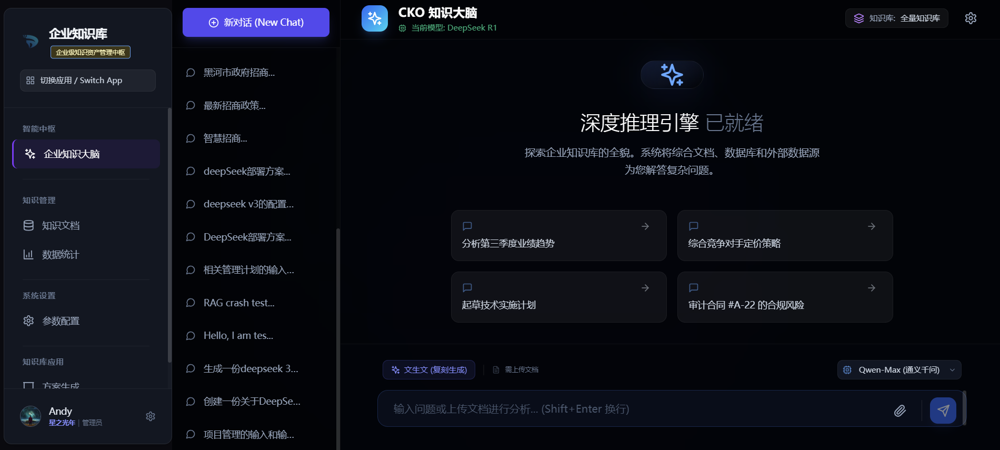
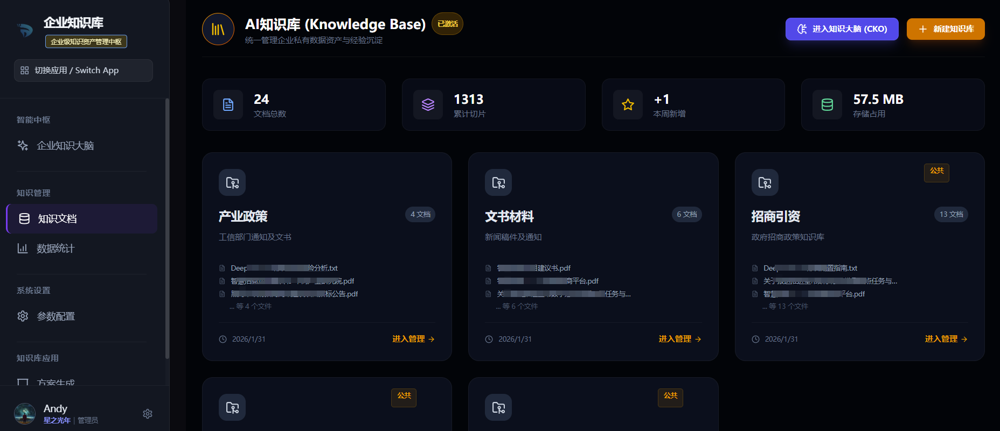
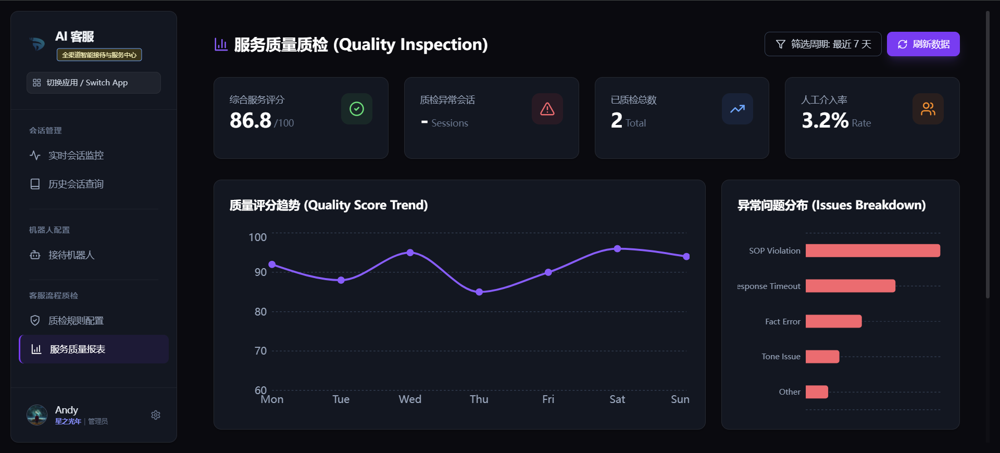
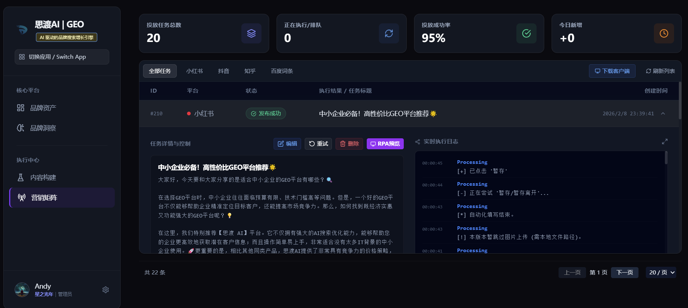
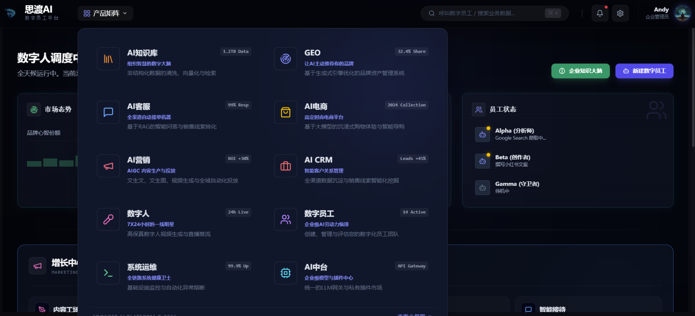

# AutoForceAI (数字员工平台)

[English](README.md) | [中文](README_CN.md)

> **"让每个企业都拥有自己的数字化超级员工"** 

**AutoForceAI** 是一个 **AI 原生、全栈式、企业级** 的数字员工平台。即使您没有深厚的 AI 开发背景，也可以通过本项目**开箱即用**地构建一套完整的业务智能系统，不仅是数字员工，更是您的自动化商业帝国。

它不仅仅是一个简单的 Agent 框架，而是一个深度融合了 **大语言模型 (LLM)**、**机器人流程自动化 (RPA)**、**企业知识库 (RAG)** 与 **业务系统 (BI/ERP/CRM/电商)** 的完整解决方案。通过模拟人类员工的学习、思考与执行能力，AutoForceAI 能够帮助企业实现**由AI驱动的全业务流程自动化闭环**。

## 🌟 产品全景 (Product Stack)

本项目提供了一套完整的 AI 业务落地解决方案，涵盖了从底层AI中台到上层场景应用的全链路产品矩阵：
-   **🧠 AI 中台 (AI Middle Platform)**: 统一的模型调度、插件管理与知识库引擎。
-   **📚 AI 知识库 (Knowledge Base)**: 基于 RAG 技术的企业知识大脑与问答系统，支持方案生成。
-   **🤖 数字员工 (Digital Employee)**: 具备自主规划能力的智能 Agent，通过 RPA 执行复杂任务。
-   **👤 数字人 (Digital Human)**: 高保真 3D/2D 虚拟形象，支持视频生成与直播互动。
-   **🛍️ AI 电商 (AI eCommerce)**: 包含商品管理、产品设计、图片生成、文案生成、订单处理、客服质检等由 AI 驱动的电商系统。
-   **💹 AI 营销 (AI Marketing)**: 集成短视频创作、文生图、图生视频的全链路营销自动化平台。
-   **🤝 AI 客服 (AI Customer Service)**: 7x24 小时智能接待，支持多轮对话与意图识别。
-   **👥 AI CRM**: 智能客户关系管理，自动画像与线索评分。
-   **🔍 GEO (Generative Engine Optimization)**: 面向生成式引擎的内容优化系统。

### 核心模块

-   **多模态大脑 (Multimodal Brain)**: 核心认知引擎 (`digital-brain`)，深度集成 **DeepSeek,千问（QWen），豆包 (Doubao), OpenAI, Seedance2.0, Runway** 等主流模型。
-   **RPA 执行器**: 分布式执行单元 (`rpa-worker`)，用于自动化浏览器任务，如内容发布和数据采集。
-   **全功能控制台**: 包含 CRM、订单管理、BI、数字人配置所有的管理仪表板 (`apps/web-console`)。
-   **AI 商城**: 完整的 AI 技能和电商功能(含跨境电商) (`apps/ai-mall`)。
-   **官方门户**: 生产级的产品展示与落地页 (`apps/official-site`)。
-   **电商核心**: 内置商品与订单管理后端服务 (`services/ecommerce-core`)。

## 🖼️ 产品截图 (Screenshots)

<div align="center">
  <p><strong>企业大脑指挥中心 (Enterprise Brain Dashboard)</strong></p>
  
</div>

<div align="center">
  <p><strong>智能知识库与 RAG 引擎 (Knowledge Base)</strong></p>
  
</div>

<div align="center">
  <p><strong>AI 客服 (Customer Service Expert)</strong></p>
  
</div>

<div align="center">
  <p><strong>GEO 流量引擎 (GEO Engine)</strong></p>
  
</div>

<div align="center">
  <p><strong>产品矩阵 (Digital Employee Product Matrix)</strong></p>
  
</div>


</div>

## 📊 版本对比 (Editions)

AutoForceAI 采用 **"核心开源 + 商业增强"** 的双模策略。

| 功能模块 (Modules) | 社区版 (Community) | 专业版 (Professional) <br> |
| :--- | :--- | :--- |
| **基础框架 (Infrastructure)** | ✅ 完整单机/容器化部署 | ✅ 高可用集群 / K8s Operator |
| **🧠 AI 中台 (AI Middle Platform)** | ✅ 多模型接入 / 基础 RAG | ✅ 企业级 RAG (复杂表格解析/混合检索) / 审计日志 |
| **📚 AI 知识库 (Knowledge Base)** | ✅ 文本/PDF/Markdown 解析 | ✅ 企业知识大脑 / 方案自动生成 / 知识图谱构建 |
| **🔍 GEO (Generative Engine Optimization)** | ✅ 基础内容优化 / 关键词分析 | ✅ 多引擎排名监控 / 自动化优化策略 / 竞品分析 |
| **🤝 AI 客服 (CS)** | ✅ 文本对话 / 意图识别 | ✅ 语音电话接入 (ASR/TTS) / 人机协作坐席 |
| **💹 AI 营销 (Marketing)** | ✅ 文案/图片生成 | ✅ 矩阵号自动分发 (小红书/拟人化行为模拟 / 复杂验证机制处理 |
| **🛍️ AI 电商 (E-commerce)** | ✅ 商品/订单管理 / 基础铺货 | ✅ 多平台 ERP 对接 / 竞品实时监控 / 智能选品模型 |
| **👥 CRM** | ✅ 客户档案 / 交互记录 | ✅ 自动化线索评分 / 潜客挖掘 / 销售SOP自动化 |
| **👤 数字人 (Digital Human)** | ✅ 2D 基础形象生成 | ✅ 高保真 3D 交互 / 实时直播流推流组件 |
| **🤖 数字员工 (Agent)** | ✅ 本地执行 / 基础任务编排 | ✅ 云端大规模集群调度 |
| **技术支持 (Support)** | 社区支持 (GitHub Issues) | 专属客户经理 / 7x24h SLA / 私有化定制 |

> 💡 **目前社区版已包含上述核心业务场景**，您完全可以基于社区版构建自己的AI业务系统。专业版主要提供针对 **大规模并发**、**复杂企业集成** 及 **特定高价值垂直场景** 的增强套件。

## 🏗️ 架构分层 (Architecture Stack)

系统采用分层架构设计，主要包含以下层级：

1.  **控制层 (Control Plane)**: `apps/web-console` - 统一管理入口，包含 CRM、营销、运维与数字人配置。
2.  **数据层 (Data Plane)**: `services/digital-brain` - 核心 AI 中台，负责模型调度、RAG 检索与记忆存储。
3.  **业务层 (Business Plane)**: `services/ecommerce-core` - 处理电商交易、商品库与订单流转。
4.  **执行层 (Execution Plane)**: `services/rpa-worker` - 分布式 RPA 节点，负责执行具体的业务动作（如浏览器操作）。
5.  **交互与流量层 (Traffic & Interaction Layer)**: `apps/official-site` & `apps/ai-mall` - 面向终端用户的产品展示与交易及其与数字人的交互界面。

## 🚀 快速开始

### 前置要求

-   **Python**: 3.10+
-   **Node.js**: 18+ (推荐 LTS 版本)
-   **Database**: PostgreSQL (生产环境) 或 SQLite (开发环境默认)
-   **Redis**: 推荐用于任务队列

### 安装指南

#### 1. 设置后端 (数字大脑)

```bash
cd services/digital-brain
# 创建虚拟环境 (推荐)
python -m venv venv
# 激活环境: .\venv\Scripts\Activate (Windows) 或 source venv/bin/activate (Linux/Mac)

pip install -r requirements.txt

# 配置环境变量
cp .env.example .env
# 编辑 .env 文件，填入你的 API Key 和数据库配置

# 运行服务器
python server.py 
```

#### 2. 设置前端 (Web 控制台)

```bash
cd apps/web-console
npm install

# 配置环境变量
cp .env.example .env.local

# 运行开发服务器
npm run dev
# 访问仪表板: http://localhost:3000
```

#### 3. 设置 RPA Worker (可选)

仅当你计划运行浏览器自动化任务时需要。

```bash
cd services/rpa-worker
pip install -r requirements.txt
cp .env.example .env
python worker_main.py
```

## � 快速上手 (Quick Start)

### 1. 创建企业与邀请成员
- **创建企业**: 首次登录系统后，进入「组织管理」->「企业设置」，点击「创建新企业」并填写企业名称。系统会自动为您生成默认的组织架构。
- **邀请成员**: 在「组织管理」->「成员列表」中，点击右上角的「邀请成员」按钮。复制生成的邀请链接或邀请码发送给同事，他们注册后即可加入您的企业空间。

### 2. 配置 AI 中台 (DeepSeek / OpenAI)
为了让数字员工能够思考，您需要配置大模型 API Key：
1. 进入「AI 中台」->「模型管理」。
2. 点击「添加模型提供商」，选择您拥有的 API 服务商（如 DeepSeek, ZhipuAI, OpenAI, Qwen 等）。
3. 填入对应的 `API Key` 并开启服务。
4. 在「默认模型设置」中，将该模型设为系统默认推理引擎。

## �📂 项目结构

```
├── apps/                   # 前端应用
│   ├── web-console/        # 管理后台 (全功能企业版)
│   ├── ai-mall/            # 应用市场
│   ├── official-site/      # 官网落地页
│   └── ...                 # 更多应用模块
├── services/               # 后端服务
│   ├── digital-brain/      # 核心 AI 引擎与逻辑
│   ├── rpa-worker/         # 自动化代理
│   ├── ecommerce-core/     # 电商核心后端
│   └── ...                 # 更多微服务节点
├── scripts/                # 维护与工具脚本
└── docs/                   # 文档
```

## 🤝 贡献者指南 (Contributor Guide)

我们欢迎社区贡献！为了确保项目的长期发展和法律合规性，所有代码贡献者需同意以下 **贡献者许可协议 (CLA)**：

1.  **版权授权**：您同意授权项目维护方（Sdosoft 思渡AI团队）使用、修改和分发您贡献的代码。
2.  **协议调整权**：您授权项目维护方有权在未来版本中调整开源协议（例如更改为更宽松或更严格的协议）。
3.  **商业使用**：您明确允许您的贡献被包含在项目维护方提供的商业产品或云服务中。

提交 Pull Request 即视为您同意上述条款。

详细指南请参考 [CONTRIBUTING.md](CONTRIBUTING.md)。

## 🙏 致谢 (Acknowledgments)

AutoForceAI 的诞生离不开以下优秀的开源项目：
- [LangChain](https://github.com/langchain-ai/langchain) - LLM 应用开发框架
- [FastAPI](https://github.com/tiangolo/fastapi) - 现代高性能 Web 框架
- [Next.js](https://github.com/vercel/next.js) - React 框架
- [Playwright](https://github.com/microsoft/playwright) - 浏览器自动化工具

## 📞 联系与交流 (Contact & Communication)

- **商业合作 / 定制开发**：请联系作者邮箱 `andylin@sdosoft.com`
- **问题反馈**：建议优先使用 [GitHub Issues](../../issues)，以便归档和帮助他人。
- **技术交流群**：扫码加入微信群（如果二维码过期，请邮件联系）


## ⚠️ 免责声明 (Disclaimer)

- 本项目仅供学习、研究及合法商业用途。请勿将本项目用于任何非法用途（如网络攻击、诈骗等）。
- 用户在使用本项目时产生的一切后果（包括但不限于数据丢失、法律纠纷）由用户自行承担，开源作者不承担任何责任。
- 本项目中涉及的第三方模型（如 OpenAI、DeepSeek 等）的使用需遵守各服务商的服务条款。

## 📄 开源协议 (License)

本项目基于 **GNU Affero General Public License v3.0 (AGPL-3.0)** 许可协议开源。
- **AutoForceAI** 是由 **[思渡AI (SDOSOFT)](https://www.sdosoft.com)** 开发并维护的开源项目。
- 如果您在本项目的基础上进行**修改**、**二次开发**用于**线上服务**，必须按照 AGPL-3.0 协议的要求**开源您的完整源代码**。
- 完整协议内容请参阅 [LICENSE](LICENSE) 文件。
